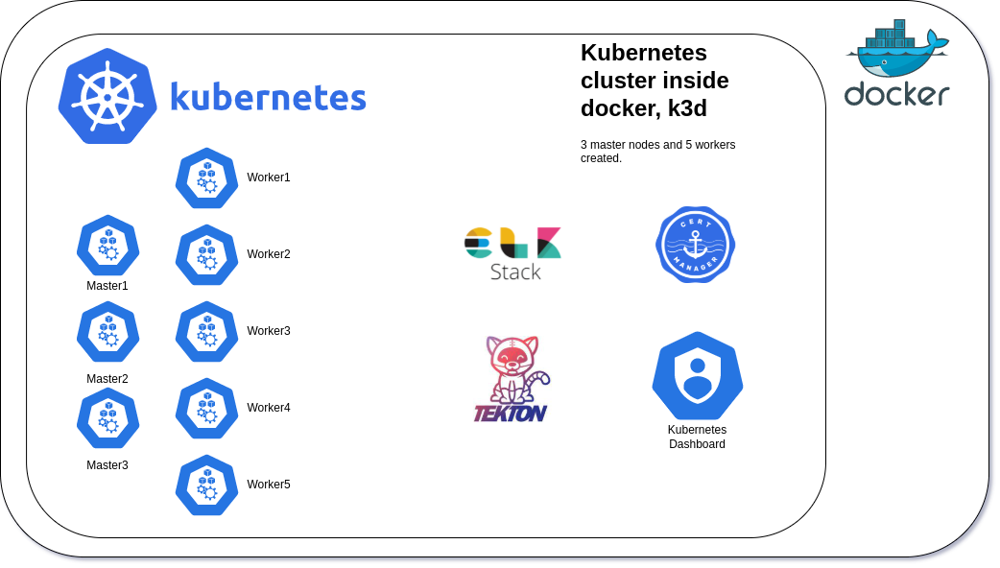

# IN HOUSE LAB
## Architecture


## Dependencies

You just need to be a linux user, if you are not yet I don't know why :)

## Quickstart

First step clone the repository
```bash
git clone https://github.com/dcristobalh/in-house-lab.git
```

Starts cluster only
```bash
make init
```

Starts cluster with apps
```bash
make all
```

If after the installation of the cluster with init you want to install more applications like tekton, elastic+kibana... you can use this commands

+ Install tekton
    ```bash
    make tekton
    ```
+ Install elastic
    ```bash
    make elastic
    ```
+ Install kubernetes dashboard
    ```bash
    make dashboard
    ```
+ Install cert-manager
    ```bash
    make cert-manager
    ```

## Destroy cluster

```bash
make destroy
```